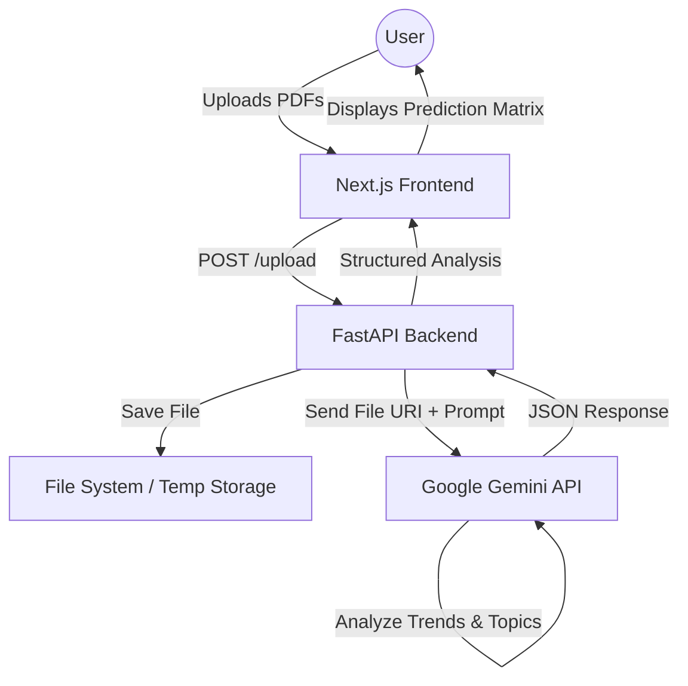

# Exam Trace - Project Report

## 1. Problem Statement & Solution Overview

### Problem Statement
Students often struggle to identify the most critical topics for their exams due to the vast amount of syllabus content and the time-consuming process of manually analyzing past years' question papers. This leads to inefficient study sessions and "blind" preparation, increasing stress and the risk of poor performance.

### Solution Overview
**Exam Trace** is an intelligent exam preparation assistant that automates the analysis of past exam papers and syllabi. Its core objective is to provide data-driven insights into topic importance, predicting which concepts are most likely to appear in upcoming exams based on historical trends.

---

## 2. Uniqueness & Differentiation

Unlike generic document summarizers or standard study guides, Exam Trace offers:

*   **Predictive Analytics**: Instead of just summarizing content, it calculates the *probability* of topics appearing in future exams.
*   **Trend Analysis**: It specifically analyzes multiple years of past papers to extract frequency data (e.g., "Appeared in 2/3 years").
*   **Agentic AI Workflow**: Utilizes a specialized AI agent (Gemini Flash) with a strictly defined persona to act as an exam analyst, extracting structured data (topics, questions, reasoning).
*   **Premium UX/UI**: Features a high-fidelity, motion-rich interface with glassmorphism and interactive elements, engaging users far more than standard educational tools.

**Competitive Advantage**: The ability to turn raw PDF exam papers into a structured, quantitative "Study Matrix" with zero manual effort.

---

## 3. How the Solution Solves the Problem

1.  **Input**: The user uploads their syllabus and a set of past exam papers (PDF format) via a drag-and-drop interface.
2.  **Processing**:
    *   The frontend securely transmits these files to the FastAPI backend.
    *   The system generates a unique session ID for the analysis.
3.  **AI Analysis**:
    *   The backend sends the documents to Google's **Gemini Flash** model.
    *   A specialized prompt instructs the AI to cross-reference the papers against the syllabus, identifying recurring themes.
    *   The AI calculates frequency metrics (e.g., how many times a topic appeared across the uploaded papers).
4.  **Output**:
    *   The system returns a structured JSON response containing topics, estimated probabilities (0-100%), frequency data, and reasoning.
    *   This data is rendered on the frontend as an interactive "Results Table" or "Prediction View," allowing students to prioritize their study plan instantly.

**Ensuring Accuracy**: The system explicitly feeds the *exact number* of uploaded papers to the AI to ensure frequency calculations (e.g., "2/3 years") are mathematically accurate and grounded in the provided context.

---

## 4. Key Features Offered

*   **Smart PDF Analysis**: Drag-and-drop support for analyzing syllabus and multiple past exam question papers simultaneously.
*   **Topic Prediction Engine**: AI-driven estimation of topic probability for upcoming exams (0-100%).
*   **Frequency Tracking**: Visual indicators of how often topics have appeared in the past (e.g., "3/3 Years").
*   **Evidence Extraction**: Automatically pulls **sample questions** from the uploaded papers for each identified topic, proving *why* a topic is important.
*   **Interactive Dashboard**: A sortable, high-contrast "Dark Mode" table view for easy consumption of insights.
*   **Visual Feedback**: Real-time system logs and animated states (particles, glowing effects) keep the user informed during the analysis process.

---

## 5. Technology Stack Used

### Frontend
-   **Next.js 16 (React 19)**: For a modern, high-performance, server-rendered application structure.
-   **Tailwind CSS**: For rapid, utility-first styling and implementing the custom "zinc" dark theme.
-   **Framer Motion**: To drive complex animations, page transitions, and the "glass" interactive effects.
-   **Three.js (@react-three/fiber)**: For high-end visual background effects (particles/paths) that differentiate the brand.
-   **Zustand**: For lightweight, global state management across the upload and analysis flows.

### Backend
-   **FastAPI (Python)**: Chosen for its speed, automatic validation (Pydantic), and native support for async operations which is crucial for handling AI requests.
-   **Google Generative AI (Gemini Flash)**: The core intelligence engine, selected for its large context window (handling multiple PDFs) and cost-effectiveness.
-   **Python-Multipart**: For efficient handling of file uploads.

---

## 6. System Architecture & Flow Diagram

The system follows a modern client-server architecture where the heavy lifting of file processing and AI inference is offloaded to the backend and cloud API, keeping the frontend responsive.

**Architecture Flow:**

**Textual Flow:**
1.  **User Layer**: Student interacts with the `Home` component, uploading files via `UploadZone`.
2.  **Presentation Layer**: `Next.js` handles the view, managing states with `Zustand` and providing visual feedback via `Framer Motion`.
3.  **Service Layer**: `FastAPI` receives the file, assigns a unique ID, and temporarily saves it.
4.  **Intelligence Layer**: The `Gemini Service` constructs a context-aware prompt and streams the file to the Gemini model.
5.  **Data Layer**: Gemini processes the unstructured PDF text and returns a structured JSON object containing the probability matrix.
6.  **Action Layer**: The frontend navigates to the `ResultsTable` view to display actionable study recommendations.
